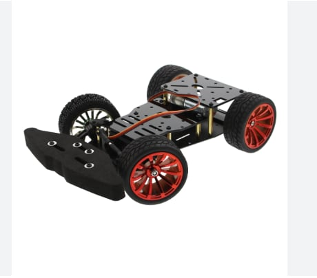
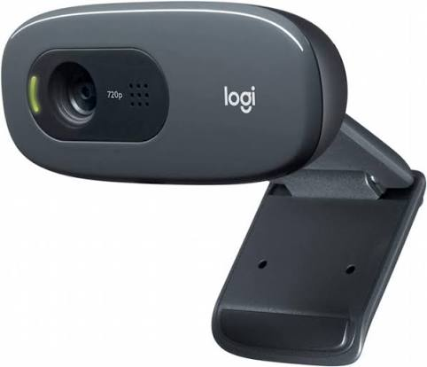

# wro2026_MicroBS
# WRO Future Engineers 2026

## Team Information

**Team Name:** MicroBS  
**Country:** Palestine 
**Organization:** BZU  
**Competition Category:** WRO Future Engineers 2026

---

## Project Overview

This repository contains the complete documentation, source code, and engineering development process of our autonomous vehicle designed for the World Robot Olympiad (WRO) Future Engineers 2026 competition.

Our objective is to design and build a reliable autonomous vehicle capable of navigating the competition field, avoiding obstacles, and completing all required challenges while following the official WRO rules.

---

## Vehicle Architecture

The vehicle consists of the following subsystems:

### Mobility System
#### Chassis Structure
  the robot is built on an aluminum body kit, which was selected for its combination of strength, durability, and low weight. The rigid aluminum frame provides a stable platform for mounting all electronic and mechanical components while withstanding the vibrations and impacts encountered during testing and competition. In addition, the chassis offers sufficient space for efficient component placement and weight distribution, contributing to the overall stability of the vehicle.

Most of the mechanical structure was assembled using the aluminum kit, reducing the need for extensive custom manufacturing. However, several parts were designed and produced using 3D printing to better meet our performance requirements. The most significant modification was the creation of larger drive gears. These gears increased the gear ratio between the motor and the wheels, allowing the system to generate higher torque. As a result, the robot achieved smoother acceleration, improved traction, and more reliable performance when navigating turns and obstacles. Testing confirmed that the larger custom gears provided better driving characteristics than the original configuration.

The protective foam bumper holds our sensors in an optimal position while absorbing crash impacts to protect both the track and the fragile front steering mechanism. Additionally, it dampens chassis vibrations to ensure cleaner sensor readings and acts as a physical safety buffer during autonomous runs.
-Chassis Photos

### 🤖 Robot Components Overview
This section provides a detailed overview of the key hardware components used in the ShahroodRC robot for the WRO 2025 Future Engineers category. Each component was carefully selected to ensure compatibility, reliability, and optimal performance for tasks like line following, obstacle avoidance, and precise parking. The components are seamlessly integrated with the LEGO EV3 platform, leveraging our team’s prior experience to streamline development and focus on competition performance.
#### 📐 Dimensions
| Dimension | Measurement |
|--------|--------|
|Length | ............. |
| Width | ...............|
| Height| ..................|
#### 🔧 Components Overview
#### Raspberry Pi 5

The Raspberry Pi 5 is the main controller of our robot. It is responsible for processing sensor data, running the autonomous navigation algorithms, and sending control commands to the motor driver.

##### Why We Chose Raspberry Pi 5

- High processing power for real-time decision making.
- Supports Python and computer vision libraries.
- Easy integration with sensors and external modules.
- Reliable performance during testing and competition runs.

##### Role in the Robot

The Raspberry Pi 5 performs the following tasks:

- Reads data from the robot's sensors.
- Processes information about the robot's environment.
- Executes navigation and control algorithms.
- Controls the movement of the robot through the motor driver.
- Manages communication between the different electronic components.

##### Integration

The Raspberry Pi 5 is connected to:

- Logitech C270 HD Webcam
- Servo Motor
Connected via control wires to send PWM signals that turn the front wheels left and right.
- L298N Motor Driver
- Power Supply
This cable receives regulated voltage directly from the blue step-down buck converter module mounted on the side, converting raw battery voltage down to a stable 5 v needed to power the Pi without frying it.
- Rear IR Sensor Module:
Connected via a data pin to send  signals back to the Pi when an obstacle is detected behind the chassis.
-Active Cooling Fan
to keep the processor cool inside the enclosure.

  #### Logitech C270 HD Webcam
  

The Logitech C270 HD Webcam is the primary vision sensor used in our robot. It provides real-time visual information that allows the robot to detect objects, identify track features, and support autonomous navigation.

##### Why We Chose the Logitech C270

- Provides reliable image quality for computer vision applications.
- Supports HD video resolution (1280 × 720).
- Compatible with the Raspberry Pi 5 and OpenCV libraries.
- Lightweight and easy to mount on the robot.
- Affordable and widely available.

##### Role in the Robot

The Logitech C270 is responsible for:

- Capturing live video of the competition field.
- Detecting obstacles and track boundaries.
- Providing visual data for image-processing algorithms.
- Supporting navigation and decision-making during autonomous operation.

##### Technical Specifications

- Resolution: Up to 1280 × 720 (HD)
- Frame Rate: Up to 30 FPS
- Connection: USB 2.0
- Fixed-focus lens
- Plug-and-play compatibility with Raspberry Pi OS

##### Integration

The Logitech C270 is connected to the Raspberry Pi 5 and provides real-time images for the robot's vision system.

#### DC motor

#### Drive mechanism
The robot uses a rear-wheel-drive mechanism powered by a single DC motor. Motion is transmitted from the motor to the rear axle through a two-gear transmission system. The two rear wheels are mechanically linked by a metal axle, ensuring that both wheels rotate together and provide consistent propulsion.

To enhance the performance of the drive system, custom gears were designed and manufactured using 3D printing. The larger gears increased the transmission ratio, allowing the robot to generate greater torque at the wheels. This improvement resulted in smoother acceleration, better traction, and more stable movement while navigating the track. Multiple tests were conducted to evaluate different gear configurations, and the final design was selected for its balance between driving power, reliability, and control.
- Steering mechanism
- Mechanical components

### Power System
- Battery
- Voltage regulation
- Power distribution

### Sensor System
- camera
- Distance sensors
  

### Software System
- Lane following
- Obstacle avoidance
- Steering control
- Autonomous decision making

---

## Development Process

This repository will be continuously updated throughout the development cycle. The commit history reflects the evolution of the project, design decisions, testing activities, and software improvements.

---

## Team Members

| Name | Role |
|--------|--------|
| Member 1 | ............. |
| Member 2 | ...............|
| Member 3 | ..................|

---

## Robot Photos

### Front View

### Rear View

### Left Side View

### Right Side View

### Top View

### Bottom View

---

## Videos

Links to autonomous driving demonstrations will be provided before the competition.

---

